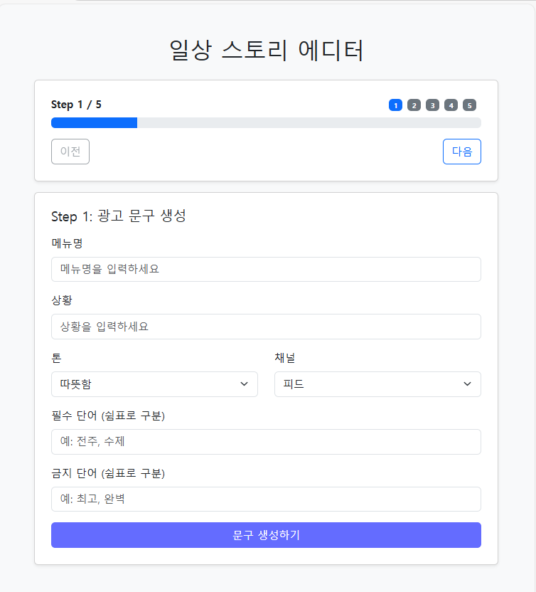

# 📢 AI 기반 인스타그램 광고 콘텐츠 자동 생성 및 평가 시스템

## 📖 프로젝트 소개
이 프로젝트는 **인공지능을 활용해 인스타그램 광고 문구와 이미지를 자동으로 생성하고, 다양한 페르소나 관점에서 평가**할 수 있는 시스템입니다.
광고 제작 과정을 자동화하여 누구나 쉽고 빠르게 마케팅 콘텐츠를 만들 수 있도록 돕습니다.

---

## 🎯 개발 배경 및 문제의식
- **광고 제작의 어려움**: 광고 문구와 이미지를 만드는 데 많은 시간과 감각적인 표현이 필요합니다.
- **마케팅 효율성 문제**: 타겟 고객별 반응을 사전에 예측하기 어렵습니다.
- **프로젝트 목표**:
  - 광고 제작 과정을 **자동화**하여 시간을 절약
  - 다양한 **페르소나별 반응 평가**를 통해 맞춤형 마케팅 전략 수립
  - 실제 SNS 업로드까지 지원하여 **엔드-투-엔드 광고 제작 파이프라인** 완성

---

## 🚀 주요 기능
1. **광고 문구 자동 생성**
   - 제품명, 특징, 톤앤매너 입력 → 캡션, 원라이너, 해시태그 자동 생성

2. **제품 사진 기반 광고 이미지 생성**
   - 제품 사진 업로드 → 광고용 이미지 자동 생성

3. **인스타그램 업로드 (개발자 계정)**
   - 생성된 콘텐츠를 실제 인스타그램 계정에 업로드

4. **다수 이미지 업로드 및 프롬프트 추가**
   - 여러 장의 이미지를 한 번에 처리 가능
   - 사용자 정의 프롬프트로 이미지 스타일 제어

5. **효용성 평가**
   - AI가 광고 문구의 효과를 점수와 피드백으로 평가
   - 예: 감성, 오퍼, CTA, 로컬, 트렌드 항목별 분석

6. **다양한 페르소나 기반 평가**
   - 대학생, 직장인, 부모 등 페르소나별 평가 결과 비교
   - 페르소나별 점수 및 피드백 제공

---

## 🎥 데모 영상

아래 이미지를 클릭하면 실행 화면 영상을 볼 수 있습니다.

[](app_screenrecording.mp4)

---

## 🛠️ 기술 스택
- **Frontend**: React, TypeScript, Bootstrap
- **Backend**: FastAPI, LangChain, Stable Diffusion 2, SAM, OpenAI API
- **AI 모델**: GPT 계열 모델, Nano Banana Pro API

---

## 설치 및 실행 방법
```bash
# 프로젝트 클론
git clone git@github.com:ai-questor/daily-story-editor.git
cd daily-story-editor

# 프론트엔드 실행
cd fronted
npm install
npm run dev -- --host 0.0.0.0

# 백엔드 실행
cd backend
uv sync
PYTHONPATH=./src uv run uvicorn main:app --reload --host 0.0.0.0 --port 8080
```

## 📸 사용 예시

### 엔드 투 엔드 워크플로우
- **목표:** 여름 시즌 프로모션용 아이스커피 광고를 제작하고 인스타그램에 게시, 이후 효용성 및 페르소나 평가까지 완료
- **초기 입력:**
  - 메뉴명: 아이스커피 라떼 500ml
  - 상황: 장마 후 첫 폭염 주간, 점심 시간 피크 타깃
  - 톤: 시원함 강조 (따뜻함/유머/프리미엄/담백 중 선택 가능)
  - 채널: 인스타그램 피드
  - 필수단어: “리프레시”, “한정판”
  - 금지단어: “저가”, “싸다”
- **예상 출력:**
  - 캡션: 2–3문장, 행동 유도 포함
  - 원라이너: 기억에 남는 1문장
  - 해시태그: 8–12개, 시즌·로컬·제품 키워드 혼합
  - 이미지: 업로드한 제품·캐릭터·배경 컷을 기반으로 스타일 적용
  - 평가: 항목별 점수와 개선 코멘트, 페르소나별 차이 비교

---

### 광고 문구 자동 생성
- **입력 필드:**
  - 메뉴명: 아이스커피 라떼 500ml
  - 상황: 폭염 주간, 점심 시간 피크 타깃
  - 톤: 담백
  - 채널: 인스타그램 피드
  - 필수단어: “리프레시”, “한정판”
  - 금지단어: “저가”, “싸다”
- **출력 예시:**
  - **캡션:**  
     “첫 폭염에는, 한 잔의 시원함이 필요하죠. 콜드브루 라떼로 가볍게 리프레시! 당도는 취향대로, 라벨은 이번 주만 한정판. 지금 바로 가까운 매장에서 만나보세요.”

     “여름엔 역시 아이스커피! 한정판 라벨로 특별함을 더하고, 시원한 콜드브루로 하루를 리프레시하세요.”

     “점심 피크 타임, 더위에 지친 당신을 위한 한 잔. 지금 바로 한정판 라떼로 시원하게 충전하세요.”
  - **원라이너:**  
    “폭염엔 라떼, 지금이 딱 그때.”
  - **해시태그:**  
    #아이스커피 #콜드브루 #라떼 #한정판라벨 #여름프로모션 #폭염대비 #점심피크 #시원함 #카페라떼 #전주카페 #완산구맛집

---

### 효용성 평가
- **항목:** 감성, 오퍼, CTA, 로컬, 트렌드
- **출력 예시:**
  - 종합 점수: 82/100
  - 항목별 피드백:
    - 감성: 폭염 맥락과 ‘리프레시’ 키워드 긍정적
    - 오퍼: 가격/혜택 부각 부족 → 한정판/시간대 프로모션 권장
    - CTA: “지금” + 장소/시간 제시 긍정적
    - 로컬: 전주/완산구 태그 적절
    - 트렌드: 여름/폭염 이슈와 아이스커피 트렌드 매칭 양호

---

### 페르소나 기반 평가
- **선택 페르소나:** 대학생, 직장인, 부모
- **결과 예시:**
  - **대학생:** 점수 84, “가격 민감도 고려 필요”, 추천 태그 #시험기간 #알바끝나고
  - **직장인:** 점수 79, “점심 시간 명시 긍정적”, 추천 태그 #점심피크 #테이크아웃
  - **부모:** 점수 73, “가족 친화 문구 부족”, 추천 태그 #아이와함께 #청결한카페

---

### 다수 이미지 업로드 + 프롬프트 조합
- **상황:** 3장의 이미지(제품, 캐릭터(옵션), 배경(옵션)) 업로드
- **목적:** 하나의 광고 캠페인에서 제품 사진을 중심으로, 캐릭터와 배경 이미지를 조합하여 다양한 스타일의 광고 이미지를 자동 생성

#### 입력 예시
1. **제품 이미지**
   - 실제 판매 제품 사진 (예: 아이스커피 라떼 컵 정면 컷)
   - 프롬프트: “제품 라벨을 중앙에 강조, 배경은 파스텔 블루로 시원한 느낌, 상단에 ‘Summer Limited’ 텍스트 배치”

2. **캐릭터 이미지 (옵션)**
   - 브랜드 마스코트 또는 캠페인 캐릭터
   - 프롬프트: “캐릭터가 제품을 들고 있는 모습, 밝고 경쾌한 표정, 배경은 그라디언트로 활기찬 분위기”

3. **배경 이미지 (옵션)**
   - 시즌/로컬 맥락을 반영한 배경 (예: 여름 해변, 도심 카페 거리)  
   - 프롬프트: “여름 해변 배경, 햇살과 파도 효과, 오른쪽 하단에 가격 태그 오버레이”

---

#### UI 흐름
1. **이미지 선택:** 제품, 캐릭터, 배경 이미지를 각각 업로드
2. **프롬프트 입력:** 이미지별 편집 지침을 텍스트로 작성
3. **생성 요청:** “이미지 생성” 버튼 클릭 → 로딩 인디케이터 표시
4. **결과 확인:** 각 이미지에 스타일 적용 결과 표시, 필요 시재편집 옵션 제공  

---

#### 출력 예시
- **제품 컷 결과:** 라벨 강조 + 시원한 색감 배경
- **캐릭터 컷 결과:** 캐릭터가 제품을 들고 있는 활기찬 컷
- **배경 컷 결과:** 시즌/로컬 맥락 반영된 배경 이미지 + 오버레이 텍스트

---

#### 활용 포인트
- **제품 중심:** 제품 이미지가 항상 메인 포커스
- **캐릭터 옵션:** 브랜드 친밀감 강화, 캠페인 스토리텔링에 활용
- **배경 옵션:** 시즌성·지역성을 반영해 광고 문구와 시각적 일관성 확보
- **일관성 유지:** 동일 캠페인 내 폰트·CTA 위치·색상 톤을 유사하게 맞춰 통일감 제공

---

### 인스타그램 업로드
- **사전 준비:** 개발자 계정 토큰, 테스트 계정
- **단계:**
  - 콘텐츠 선택 → 이미지 + 캡션
  - 미리보기 → 모바일 뷰 확인
  - 업로드 → 로딩 표시
  - 결과 → 포스트 URL/ID 표시
- **베스트 프랙티스:**
  - 해시태그 순서: 브랜드/제품 → 시즌/트렌드 → 로컬
  - CTA 자연스러움: “지금 근처 매장에서”, “오늘 점심에”

---

### API 요청/응답 예시
#### 문구 생성 요청
```bash
curl -X POST /api/generate \
  -H "Content-Type: application/json" \
  -d '{
    "menu": "아이스커피 라떼 500ml",
    "channel": "피드",
    "tone": "프리미엄",
    "context": "폭염 주간, 점심 피크 타깃"
  }'
```
#### 문구 생성 응답
```json
{
  "captions": [
    "첫 폭염에는, 한 잔의 시원함이 필요하죠...",
    "오랜 시간 쌓아온 레시피의 핵심은..",
    "지친 하루의 작은 위로가 필요할 때.."
  ],
  "one_liner": "폭염엔 라떼, 지금이 딱 그때.",
  "hashtags": ["#아이스커피","#콜드브루","#라떼","#서울카페","#노원구맛집"]
}
```

---

## 📊 성과 및 기대효과
- 광고 제작 시간을 대폭 단축
- 타겟 고객별 반응을 사전 예측 가능
- 실제 SNS 업로드까지 지원 → 엔드-투-엔드 자동화 파이프라인 완성
- 마케팅 효율성 및 ROI 향상 기대

---

## 🔮 향후 개선 방향
- 인프라 최적화: 배포, 로깅, 모니터링 강화
- 테스트 자동화: 주요 API 및 컴포넌트 단위 테스트 추가
- UI/UX 개선: 로딩 인디케이터, 선택 강조, 애니메이션 효과
- 확장성: 다른 SNS 플랫폼(예: TikTok, Facebook) 지원

---

## 📎 제출 자료

1. **Github 리포지토리 주소**
   - [리포지토리 바로가기](https://github.com/ai-questor/daily-story-editor)

2. **보고서 PDF 파일**
   - [최종 보고서 다운로드](https://github.com/ai-questor/daily-story-editor/blob/main/final_report.pdf)

3. **개인 일지**
   - [개인 일지](https://stormy-bamboo-cb9.notion.site/2a1d8eb5efbb80b38d28cf9b6bc1e3e6)

4. **프로젝트 관리**
   - [프로젝트 관련 문서들](https://www.notion.so/2b0d8eb5efbb80fb9364df52012eeae1)